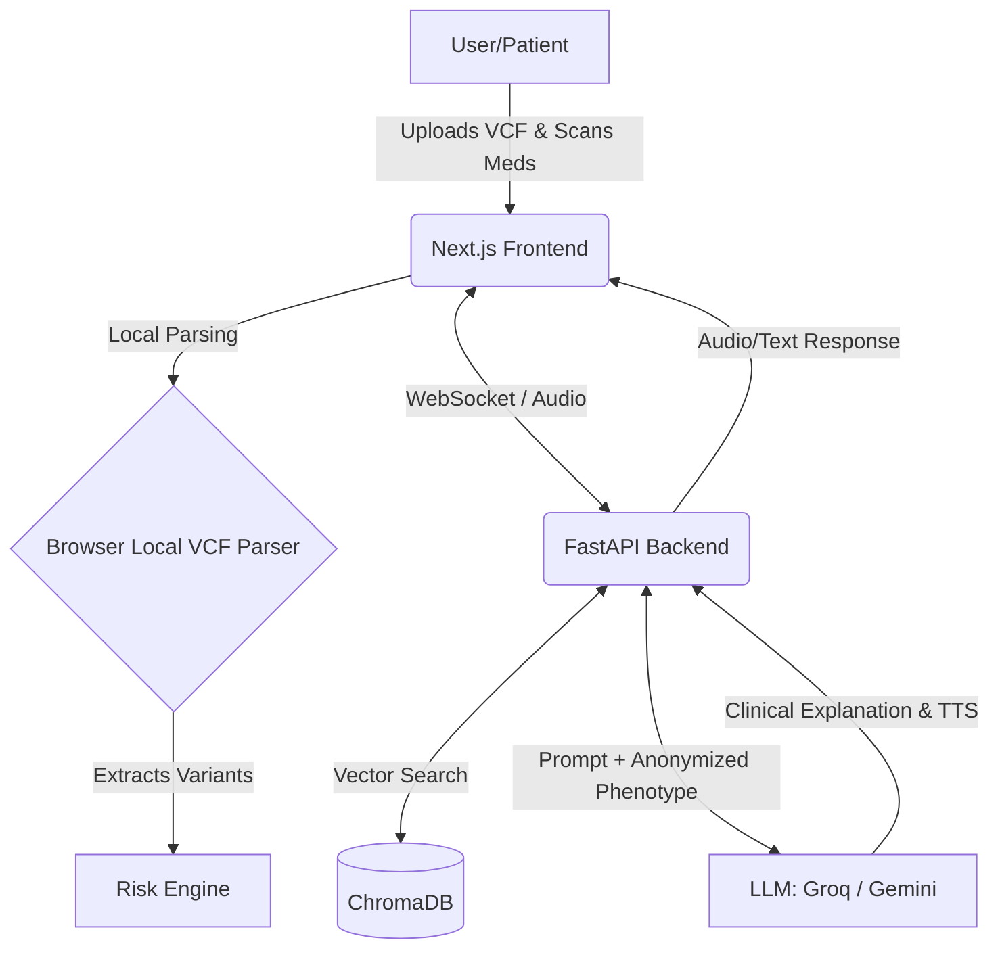

# PharmaGuard 🧬💊

[](https://opensource.org/licenses/MIT)
[]()
[](https://nextjs.org/)
[](https://fastapi.tiangolo.com/)
[](https://gemini.google.com/)

> **An AI-powered pharmacogenomic risk prediction system and voice agent that parses raw genomic data locally to prevent adverse drug reactions.**

---

## 📖 Problem Statement

Adverse drug reactions (ADRs) are a leading cause of mortality, taking over 100,000 lives annually in the US alone. Many of these tragic outcomes are completely preventable through pharmacogenomic testing, which analyzes how an individual's genetic variants affect drug metabolism. However, interpreting raw genomic data is incredibly complex and raises severe patient privacy concerns. PharmaGuard bridges this critical gap by translating raw genetic data into actionable clinical decision-making, ensuring patient privacy while empowering healthcare providers and patients to make informed, personalized medication choices.

---

## 💡 Solution Overview

PharmaGuard solves the complex challenge of pharmacogenomics by utilizing a **Privacy-First Hybrid Architecture**. Raw genomic data (VCF files) is parsed entirely within the browser, ensuring sensitive information never leaves the user's device. The system extracts variants for critical genes (CYP2D6, CYP2C19, etc.) and calculates an "Honest Confidence" risk score based on CPIC guidelines.

**How AI powers the core experience:**
We integrate **Groq (Llama-3 70B)** and **Gemini Flash 2.0** to drive an Explainable AI engine and a Multimodal Voice Agent. Instead of just displaying raw genomic risks, the AI translates complex diplotypes into digestible clinical explanations and interacts with users via real-time voice conversations. To guarantee privacy, only pseudonymized phenotype labels (e.g., "CYP2D6 *4/*4") are sent to the LLM, strictly excluding any Personal Health Information (PHI).

---

## 🎥 Demo

- **Demo Video**: [INSERT_DEMO_VIDEO_LINK]
- **Live Demo**: [https://genomaveda.vercel.app/](https://genomaveda.vercel.app/)

### Screenshots


*The interactive Risk Dashboard showing actionable drug insights.*


*Real-time multimodal voice agent analyzing scanned medicines.*

---

## 🛠️ Tech Stack

### Frontend
- **Next.js 14, React, TailwindCSS, Framer Motion**: Chosen for a blazing fast, responsive, and visually engaging user interface.
- **D3.js**: Chosen to visualize patient-specific metabolic pathways via interaction fingerprints.

### Backend
- **FastAPI (Python), WebSockets**: Chosen for high-performance, asynchronous handling of real-time streaming for the interactive Voice Agent.

### AI/ML Layer
- **Groq (Llama-3 70B) & Gemini Flash 2.0**: Chosen for ultra-fast, accurate LLM inference, clinical reasoning, and cutting-edge multimodal (vision/speech) capabilities.

### Database
- **ChromaDB**: Chosen as the vector database for efficient semantic search and retrieval of complex medical guidelines.
- **MongoDB**: Chosen for flexible, scalable storage of non-PHI application data.

### DevOps / Deployment
- **Vercel**: Chosen for seamless frontend deployment, edge network distribution, and automatic CI/CD.

---

## ✨ Features

- **🤖 AI-Powered Clinical Explanations**: Agentic AI generates clear, personalized drug risk assessments and alternative medication suggestions without exposing PHI.
- **🎙️ Real-time Multimodal Voice Agent**: Speak directly with the PharmaGuard agent to understand your genomic profile, complete with webcam-based medicine scanning.
- **🛡️ Client-Side VCF Parsing**: Raw genomic data is processed 100% locally in the browser to maintain absolute privacy.
- **📊 "Honest Confidence" Risk Prediction**: Advanced scoring system combining VCF quality, diplotype certainty, and CPIC guidelines with differential privacy.
- **👻 Zero-Persistence Mode**: Real-time Privacy Shield UI that tracks data location and auto-clears browser memory to guarantee security.

---

## 🏗️ Architecture Diagram



---

## 🚀 Getting Started

### Prerequisites
- Node.js 18.x or higher
- Python 3.10+
- API Keys for Groq and Gemini
- MongoDB connection string

### Installation & Setup

1. **Clone the repository:**
   ```bash
   git clone https://github.com/Aditya-Patil27/pharmaguard.git
   cd pharmaguard
   ```

2. **Frontend Setup:**
   ```bash
   cd frontend
   npm install --legacy-peer-deps
   
   # Set up environment variables
   cp .env.example .env.local
   # Edit .env.local and add your GROQ_API_KEY and Next.js settings
   
   # Run the development server
   npm run dev
   ```

3. **Backend Setup:**
   ```bash
   cd backend
   python -m venv venv
   source venv/bin/activate  # On Windows: venv\Scripts\activate
   pip install -r requirements.txt
   
   # Set up environment variables
   cp .env.example .env
   # Add your GEMINI_API_KEY, MONGODB_URI and other configs
   
   # Run the FastAPI server
   uvicorn main:app --reload
   ```

PharmaGuard frontend will be running on `http://localhost:3000` and the backend on `http://localhost:8000`.

---

## 🧠 How It Was Built

Our team set out to balance powerful AI medical capabilities with incredibly strict healthcare privacy requirements. We started by building a custom TypeScript VCF parser so that large genomic files are processed entirely on the client-side—ensuring the raw variants never touch our servers. 

One of the most significant challenges was building the Voice Agent. The backend required handling real-time WebSockets, streaming audio, and vector database lookups simultaneously. Initially, blocking FAISS/ChromaDB retrievals exhausted our thread pool and degraded the streaming experience. We overcame this by refactoring the Python backend to use fully asynchronous queues, offloading blocking operations, and implementing robust WebSocket disconnection handling to clean up orphaned AI tasks. Ultimately, we achieved a secure, low-latency hybrid architecture where anonymized phenotype data is seamlessly enriched by high-performance LLMs.

---

## 🔮 What's Next

1. **Wearable Integration**: Syncing with smartwatches to monitor real-time vitals alongside medication responses.
2. **Expanded Gene Panel**: Scaling our localized VCF parser to support more than the core 6 metabolizer genes.
3. **Multilingual Voice Agent**: Leveraging advanced TTS/STT APIs to provide personalized pharmacy advice in multiple regional languages.
4. **Federated Learning**: Aggregating anonymized risk patterns across clients to improve our predictive models without ever centralizing patient data.

---

## 👥 Team: THE INTERCEPTORS

- **Aditya Patil** — Backend Lead & Team Leader ([GitHub](https://github.com/Aditya-Patil27))
- **Nishida Datkar** — Frontend Lead
---

## 📄 License

This project is licensed under the [MIT License](LICENSE).
